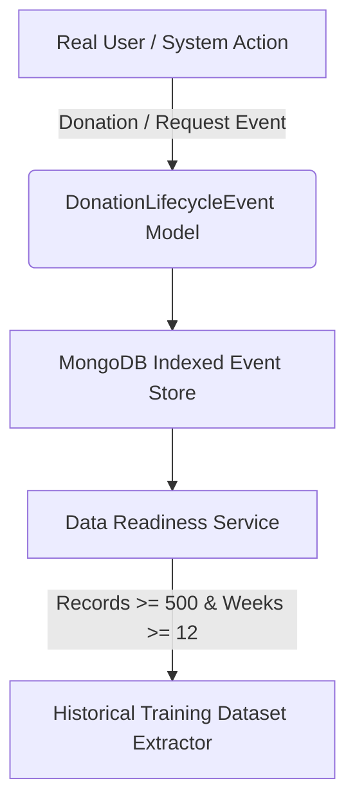

# FoodBridge AI Model Retraining Plan & Data Architecture

## Overview
This document specifies the operational data pipeline, validation gates, feature engineering, temporal leakage audits, and deployment criteria required before any AI model in FoodBridge-AI can be retrained on production database records.

---

## 1. Operational Event Data Collection Pipeline

All production lifecycle events are logged idempotently to MongoDB collection `donation_lifecycle_events`:



### Tracked Event Types:
- `DONATION_CREATED`: Initial surplus food listing posted.
- `DONATION_UPDATED`: Listing fields modified.
- `DONATION_CANCELLED`: Listing cancelled by donor.
- `DONATION_EXPIRED`: Best-before deadline reached without pickup.
- `REQUEST_CREATED`: Pickup request submitted by NGO.
- `REQUEST_ACCEPTED`: Pickup request accepted by donor.
- `REQUEST_REJECTED`: Pickup request declined.
- `REQUEST_CANCELLED`: Request cancelled by NGO.
- `PICKUP_SCHEDULED`: Pickup time window agreed.
- `PICKUP_STARTED`: NGO courier dispatched for pickup.
- `PICKUP_COMPLETED`: Food physically transferred and verified.
- `DONATION_DISTRIBUTED`: Meals distributed to beneficiaries.

---

## 2. Retraining Readiness Threshold Gates

A model MAY NOT be retrained or deployed as `FOODBRIDGE_PRODUCTION_MODEL` until all 5 gates pass:

1. **Gate 1 — Usable Record Volume**: $\ge 500$ complete historical transaction sequences.
2. **Gate 2 — Temporal Coverage**: $\ge 12$ consecutive calendar weeks of operational event logs.
3. **Gate 3 — Target Verification**: Legitimate operational target exists (e.g. `time_to_successful_pickup` calculated as `PICKUP_COMPLETED.timestamp - DONATION_CREATED.timestamp`).
4. **Gate 4 — Target Leakage Audit**: All prediction features must be restricted to data available at prediction time. No post-pickup fields may be used.
5. **Gate 5 — Naive Baseline Outperformance**: Machine learning candidate model must meaningfully outperform naive previous-outcome and mean historical baselines on untouched test data ($R^2 > 0.50$ for regression, $F1 > 0.85$ for classification).

---

## 3. Retraining Execution Protocol

```
Real MongoDB Events
       ↓
Data Validation & Deduplication
       ↓
Feature Engineering & Temporal Leakage Audit
       ↓
Chronological Train/Validation/Test Split (70 / 15 / 15)
       ↓
Baseline Comparison (Naive Mean vs ML Candidates)
       ↓
Model Selection & Metric Evaluation
       ↓
Model Registry Promotion (EXTERNAL_DATA_MODEL → FOODBRIDGE_PRODUCTION_MODEL)
       ↓
FastAPI Service Serialization & Zero-Downtime Deployment
```

---

## 4. Current Status Matrix

| Model | Status | Dataset Source | FoodBridge-Trained | Retraining Threshold |
| :--- | :--- | :--- | :--- | :--- |
| **Demand Prediction** | `EXTERNAL_DATA_MODEL` | Kaggle Food Demand Forecasting | `false` | Requires $\ge 500$ FoodBridge records |
| **Food Quality Risk** | `EXTERNAL_DATA_MODEL` | Public Milk Quality Dataset | `false` | Scope limited to milk; requires sensor hardware |
| **Donation Priority** | `INSUFFICIENT_DATA` | MongoDB FoodBridge Database | `false` | Requires $\ge 500$ records across $\ge 12$ weeks |
| **NGO Recommendation** | `LIVE_RULE_BASED` | MongoDB Verified NGOs + OSM | `false` | Rule-based scoring engine |
| **Route Optimization** | `LIVE_ALGORITHMIC` | Real Geographic Coordinates | `false` | Haversine / Routing graph algorithm |
